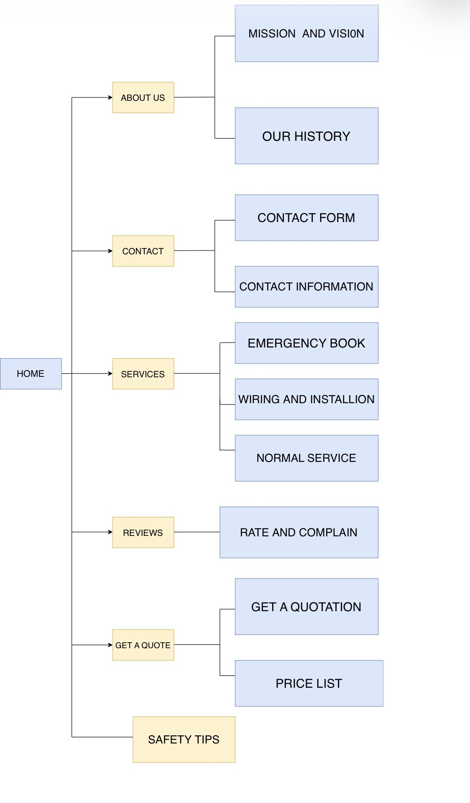

# Project Title
Jimmy Neutron Electricians

## Student Information
**Student number:** ST10534549  
**Student Name:** Buti Benny Banda

## Project Overview

This project proposes a website for Jimmy Neutron Electricians, an electrical services company founded in 2019 by Lucky Jimmy Ndlovu to address the impact of loadshedding on residential and commercial clients. The organisation's mission is to combine time-honoured electrical craftsmanship with modern smart technology to deliver reliable services. The website aims to establish trust, provide 24/7 access through emergency booking and quotation features, improve local visibility, and educate customers with safety tips. Key functionality will include online bookings, payments, service information, with success measured by KPIs such as conversion rates ,local map pack ranking, session duration, and page load speed.
## Website Goals and Objectives

The main goal of this website is to provide efficient, trustworthy access to our electrical services.Since most people now use digital platforms to research and find information, the website will establish trust and make it easy for customers to book services online.
Key Objectives:*Create 24/7 availability
               *Increase local visibility
               *Educate and support customers 

## Timeline and Milestones

will do it later.

## Sitemap

[Website Sitemap]

## References

Ensure that all sources used in your assignment are cited and referenced using the Harvard referencing style.
